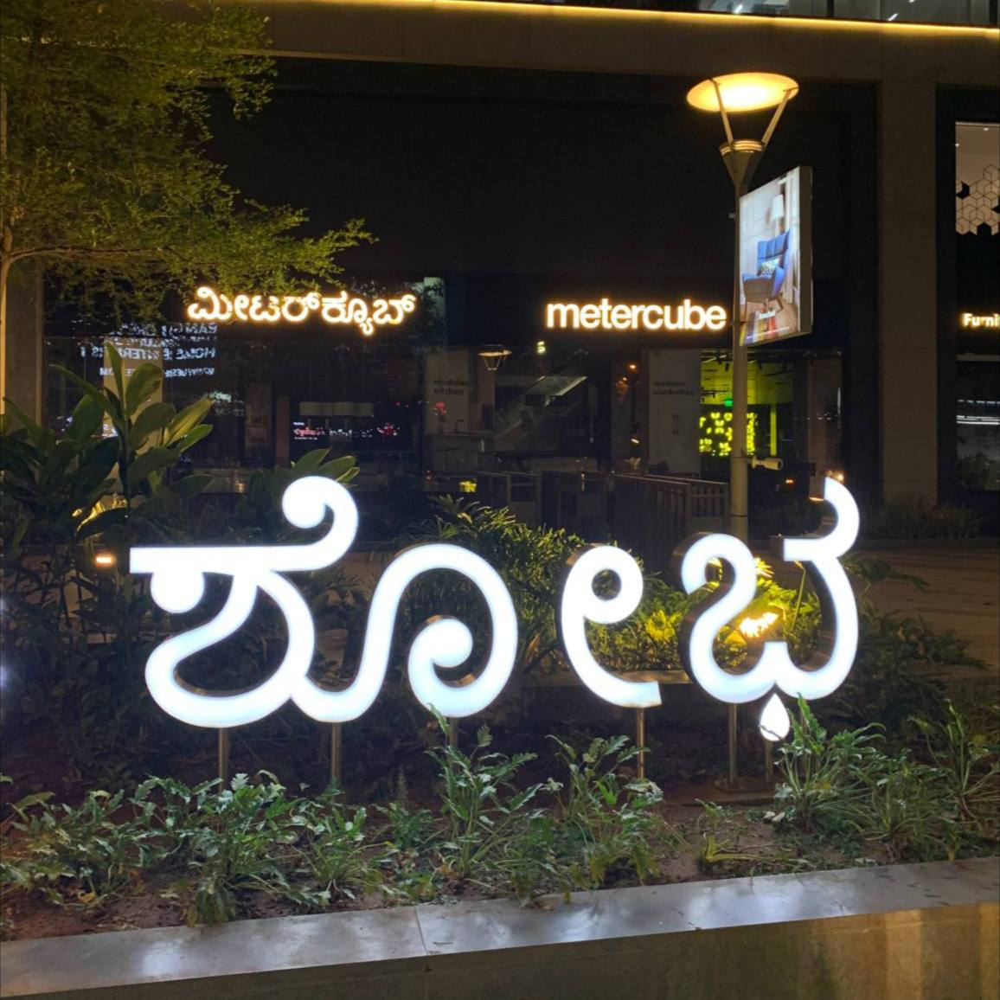

title: Языки Индии
date: 03.03.2023
tags: Путешествия, Индия

---

Дети, на каком языке разговаривают в Индии? Хинди?

А вот и нет. Хинди здесь, наряду с английским — lingua franca, официальные языки государства, при этом носителей хинди как родного в Индии всего от 250 до 450 миллионов человек (в зависимости от учета диалектов) из 1,4 миллиардов населения.

В каждом штате Индии проживают отдельные народы, де факто использующие собственные языки. Насчитывается 22 языка более чем с 1 миллионом носителей, и ещё сотни более мелких.

Например:
- Мумбаи, штат Махараштра.
  Язык: маратхи (मराठी).
  83 миллиона носителей.
- Панаджи, штат Гоа.
  Язык: конкани (कोंकणी).
  1,7 миллионов носителей.
- Бангалор, штат Карнатака.
  Язык: каннада (ಕನ್ನಡ).
  38 миллионов носителей.

И так далее. Различается даже система письма.

К слову, носителей языка маратхи больше, чем носителей турецкого, корейского, немецкого и французского.